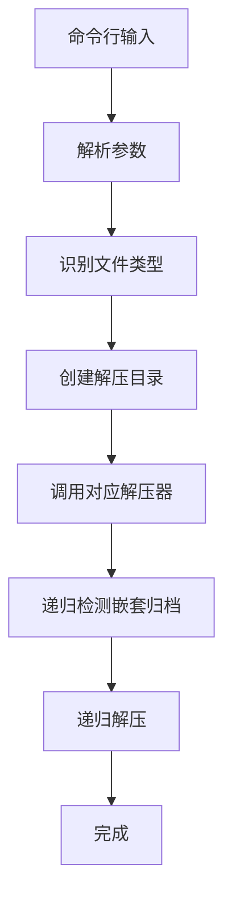

# Unbox - Archive Extractor

[](https://forthebadge.com)

`Unbox` 是一个命令行归档文件解压工具，支持多种压缩格式并能处理嵌套归档。

## 功能特性

- **多格式支持**：自动检测并解压 `tar`, `zip`, `rar`, `gzip`, `bzip2`, `xz`, `zstd`, `7z` 等格式
- **递归解压**：自动检测并解压嵌套的归档文件 (`-r` 选项)
- **安全操作**：
  - 防止路径遍历攻击
- **批量处理**：支持同时解压多个文件

## 安装

### 源码安装 (需Go 1.20+)
```bash
go install github.com/Geekstrange/Unbox@latest
```

### 依赖说明

部分格式需要系统安装：

```bash
# Debian/Ubuntu
sudo apt install unrar p7zip-full zstd

# RHEL/CentOS
sudo yum install unrar p7zip zstd
```

## 使用指南

### 基本用法

```bash
Unbox archive.zip        # 创建archive目录并解压
Unbox file1.tar file2.zip # 批量解压
```

### 常用选项

|    选项     |       描述       |         示例          |
| :---------: | :--------------: | :-------------------: |
|    `-r`     | 递归解压嵌套归档 | `Unbox -r bundle.zip` |
|    `-l`     |   列出归档内容   | `Unbox -l files.rar`  |
|    `-o`     | 解压后删除源文件 | `Unbox -o update.zip` |
|    `-s`     | 显示支持格式列表 |      `Unbox -s`       |
|    `-h`     |   显示帮助信息   |      `Unbox -h`       |
| `--version` |   显示版本信息   |   `Unbox --version`   |

### 递归解压示例

```bash
Unbox -r software_bundle.zip
# 输出:
# 正在解压 software_bundle.zip 到 software_bundle...
# 开始递归解压嵌套文件: software_bundle
```

## 解压行为说明

1. 默认创建与归档同名的目录（不含扩展名）
2. 所有内容解压到该目录中
3. 目录权限设为755，文件权限设为644
4. 递归解压时会删除已解压的嵌套归档

## 常见问题

**Q: 解压后文件权限不正确？**
A: 工具会自动设置目录为755，文件为644权限

**Q: 为什么解压后多了一层目录？**
A: 这是默认行为，避免污染当前目录

**Q: 如何批量解压当前目录所有zip文件？**

```bash
Unbox *.zip
```

**Q: 支持哪些格式？**
A: 运行 `Unbox -s` 查看完整列表：

```bash
7z
Z
arj
br
bz2
...（完整列表见实际输出）
```

**Q: rar/7z解压报错？**
A: 确保系统已安装 `unrar` 和 `7z` 命令

## 技术说明




## 许可证

Apache License 2.0 - 详情见项目 LICENSE 文件

主要变更总结：
1. 移除了未实现功能的描述（扁平化、交互式、智能目录处理等）
2. 修正了所有选项描述与实际代码匹配
3. 添加了必要的依赖说明
4. 简化了递归解压的说明
5. 明确了默认解压行为（创建目录）
6. 更新了常见问题与实际行为一致
