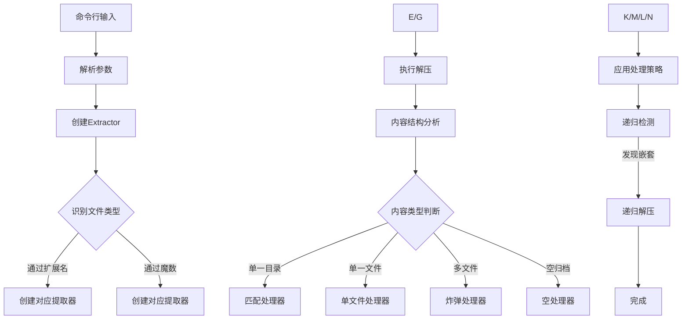

# Unbox - Intelligent Archive Extractor

[](https://opensource.org/licenses/Apache-2.0)


`Unbox` 是一个智能化的命令行归档文件解压工具，能够自动识别多种压缩格式并智能处理文件结构。它特别擅长处理嵌套归档和优化目录结构，让文件解压变得简单高效。

## ✨ 功能特性

- **多格式支持**：自动检测并解压 `tar`, `zip`, `rar`, `gzip`, `bzip2`, `xz`, `zstd` 等20+格式
- **智能结构处理**：
  - 自动重名名冲突文件
  - 智能展开单文件目录
  - 扁平化嵌套结构 (`-f` 选项)
- **递归解压**：自动检测并解压嵌套的归档文件 (`-r` 选项)
- **安全操作**：
  - 交互式操作确认
  - 非交互批处理模式 (`-n` 选项)
  - 权限自动修复
- **轻量化**：纯Go实现，无额外依赖

## 📦 安装

### 源码安装 (需Go 1.20+)
```bash
go install github.com/Geekstrange/Unbox@latest
```

### 二进制下载

从 Releases 页面 下载预编译二进制

## 🚀 使用指南

### 基本用法

```bash
Unbox archive.zip
Unbox file.tar.gz
```

### 常用选项

| 选项 |         描述         |         示例          |
| :--: | :------------------: | :-------------------: |
| `-r` |   递归解压嵌套归档   | `Unbox -r bundle.zip` |
| `-f` | 扁平化输出到当前目录 |  `Unbox -f data.tgz`  |
| `-l` | 列出归档内容而不解压 | `Unbox -l files.rar`  |
| `-o` |    覆盖已存在文件    | `Unbox -o update.zip` |
| `-n` |   非交互批处理模式   |   `Unbox -n *.tar`    |
| `-q` |  安静模式(减少输出)  | `Unbox -q large.zip`  |
| `-v` |     显示版本信息     |      `Unbox -v`       |

### 处理远程文件

```
Unbox https://example.com/archive.tar.gz
```

### 递归解压示例

```bash
# 解压主归档+所有嵌套归档
Unbox -r software_bundle.zip

# 输出示例
Processing software_bundle.zip
  Contains 3 nested archives
Extract nested? [A]lways/[O]nce/[N]ever/[L]ist? A
✅ Successfully extracted 4 archives
```

## 🧩 技术架构



## 🤝 贡献指南

我们欢迎贡献！请遵循以下流程：

1. Fork 仓库
2. 创建特性分支 (`git checkout -b feature/your-feature`)
3. 提交更改 (`git commit -am 'Add some feature'`)
4. 推送分支 (`git push origin feature/your-feature`)
5. 创建 Pull Request

**开发要求**：

- Go 1.20+
- 遵循现有代码风格
- 新增功能需包含测试
- 更新文档 (README 或 godoc)

## 📜 许可证

本项目采用 **Apache License 2.0** - 详情见 LICENSE 文件。

```
Unbox version 0.0.1
Copyright 2025 Geekstrange

Licensed under the Apache License...
```

## ⁉️ 常见问题

**Q: 如何解压受密码保护的归档？**
A: 当前版本暂不支持加密归档的解压

**Q: 解压后文件权限不正确？**
A: `Unbox` 会自动设置目录为755，文件为644权限

**Q: 为什么有些归档解压后多了一层目录？**
A: 当归档内含同名目录时，`Unbox` 会保留原始结构。使用 `-f` 选项可扁平化输出

