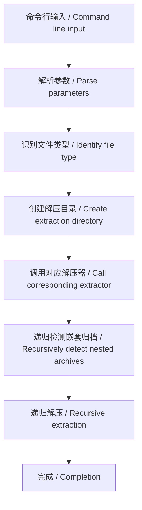

# Unbox - 智能解压工具 / Smart Unarchiving Tool

`Unbox` 是一个命令行归档文件解压工具, 支持多种压缩格式并能处理嵌套归档
`Unbox` is a command-line archive extraction tool that supports multiple compression formats and handles nested archives.

## 功能特性 / Features

- **多格式支持**: 自动检测并解压 `tar`, `zip`, `rar`, `gzip`, `bzip2`, `xz`, `zstd`, `7z` 等格式
  **Multi-format support**: Automatically detects and extracts formats like `tar`, `zip`, `rar`, `gzip`, `bzip2`, `xz`, `zstd`, `7z`
- **递归解压**: 自动检测并解压嵌套的归档文件 (`-r` 选项)
  **Recursive extraction**: Automatically detects and extracts nested archives (with `-r` option)
- **批量处理**: 支持同时解压多个文件
  **Batch processing**: Supports extracting multiple files simultaneously

## 安装 / Installation

### 源码安装 (需 Go 1.20+) / Source Installation (Requires Go 1.20+)


```bash
go install github.com/Geekstrange/Unbox@latest
```

### 依赖说明 / Dependency Notes

部分格式需要系统安装:
Some formats require system installation:

```bash
# Debian/Ubuntu
sudo apt install unrar p7zip-full zstd

# RHEL/CentOS
sudo yum install unrar p7zip zstd
```

## 使用指南 / Usage Guide

### 基本用法 / Basic Usage

```bash
Unbox archive.zip        # 创建archive目录并解压 / Creates archive directory and extracts
Unbox file1.tar file2.zip # 批量解压 / Batch extraction
```

### 常用选项 / Common Options

| 选项 / Option | 描述 / Description                                     | 示例 / Example        |
| ------------- | ------------------------------------------------------ | --------------------- |
| `-r`          | 递归解压嵌套归档 / Recursively extract nested archives | `Unbox -r bundle.zip` |
| `-l`          | 列出归档内容 / List archive contents                   | `Unbox -l files.rar`  |
| `-o`          | 解压后删除源文件 / Delete source file after extraction | `Unbox -o update.zip` |
| `-s`          | 显示支持格式列表 / Show supported formats list         | `Unbox -s`            |
| `-h`          | 显示帮助信息 / Show help information                   | `Unbox -h`            |
| `--version`   | 显示版本信息 / Show version information                | `Unbox --version`     |

### 递归解压示例 / Recursive Extraction Example

```bash
Unbox -r software_bundle.zip
# 输出: / Output:
# 正在解压 software_bundle.zip 到 software_bundle... / Extracting software_bundle.zip to software_bundle...
# 开始递归解压嵌套文件: software_bundle / Starting recursive extraction of nested files: software_bundle
```

### 解压行为说明 / Extraction Behavior Notes

1. 默认创建与归档同名的目录 (不含扩展名)
   By default, creates a directory with the same name as the archive (without extension)
2. 所有内容解压到该目录中
   All contents are extracted into this directory
3. 目录权限设为 755, 文件权限设为 644
   Directory permissions set to 755, file permissions set to 644
4. 递归解压时会删除已解压的嵌套归档
   Deletes extracted nested archives during recursive extraction

## 常见问题 / FAQ

**Q: 解压后文件权限不正确？**

**Q: File permissions are incorrect after extraction?**

A: 工具会自动设置目录为 755, 文件为 644 权限

A: The tool automatically sets directories to 755 and files to 644 permissions

**Q: 为什么解压后多了一层目录？**

**Q: Why is there an extra directory layer after extraction?**

A: 这是默认行为, 避免污染当前目录

A: This is default behavior to avoid cluttering the current directory

**Q: 如何批量解压当前目录所有 zip 文件？**

**Q: How to batch extract all zip files in the current directory?**

```bash
Unbox *.zip
```

**Q: 支持哪些格式？**

**Q: Which formats are supported?**

A: 运行 `Unbox -s` 查看完整列表:

A: Run `Unbox -s` to see the full list:

```bash
7z
Z
arj
br
bz2
... (完整列表见实际输出)/ ...(see actual output for full list)
```

**Q: rar/7z 解压报错？**

**Q: Errors when extracting rar/7z files?**

A: 确保系统已安装 `unrar` 和 `7z` 命令

A: Ensure `unrar` and `7z` commands are installed on the system

## 技术说明 / Technical Notes




## 版本选择指南 / Version Selection Guide

根据您的操作系统和架构, 请选择对应的安装文件以下是不同平台的版本对应关系:
Select the appropriate installation file based on your operating system and architecture:

| 操作系统 / OS | 架构 / Architecture           | 文件名 / Filename                |
| ------------- | ----------------------------- | -------------------------------- |
| **Linux**     | x86_64/AMD64                  | `unbox-vx.x.x-linux_amd64`       |
|               | ARM64/AArch64                 | `unbox-vx.x.x-linux_arm64`       |
|               | LoongArch                     | `unbox-vx.x.x-linux_loong64`     |

## 如何确定我的系统架构 / How to Determine Your System Architecture

### Linux 系统 / Linux System

1. **打开终端**: 可以通过在应用程序菜单中搜索 “终端” 或使用快捷键 (通常是`Ctrl+Alt+T`)来打开
   **Open Terminal**: Search for "Terminal" in the application menu or use the shortcut (usually `Ctrl+Alt+T`)

2. 输入命令: 在终端中输入以下命令并按回车键:

   Enter command: Type the following command in Terminal and press Enter:

```bash
arch
```

3. 查看输出结果:

   Check output:

   - 如果显示`x86_64`, 则您的系统是**64 位 (x86_64)**
   - If `x86_64` is displayed, your system is **64-bit (x86_64)**
   - 如果显示`aarch64`, 则您的系统是**ARM64**
   - If `aarch64` is displayed, your system is **ARM64**
   - 如果显示`loong64`, 则您的系统是**LoongArch**
   - If `loong64` is displayed, your system is **LoongArch**
## 许可证 / License

<a href="https://www.apache.org/licenses/LICENSE-2.0.html" target="_blank"><imgsrc="https://github.com/Geekstrange/unbox/blob/main/img/Apache-License.svg"alt="Apache License 2.0"width="180"height="auto"></a>

Apache License 2.0 - 详情见项目 LICENSE 文件
Apache License 2.0 - See the project's LICENSE file for details
